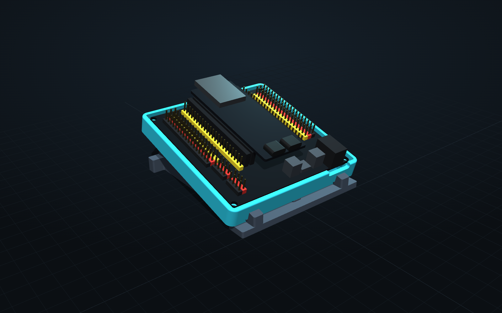
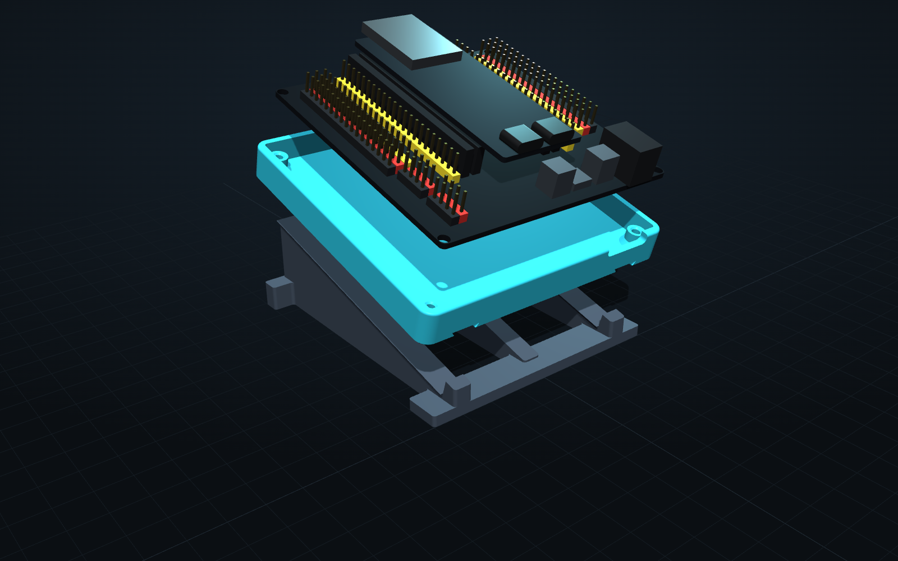

# BenchBuddy Dock

The housing for BenchBuddy v1: a low tray that the ESP32-S3 + GPIO extension board screws into, and a stand that tilts it 15° toward you. The top is fully open, so every header, the buttons, the USB-C ports and the RGB LED stay reachable.



## What's in this folder

| File | What it is |
|---|---|
| `exports/BenchBuddy_Dock_plate_fit_test.3mf` | **Print this first.** Fit-test frame and dovetail test pieces, laid out on a QIDI Q1 Pro bed (245 mm). |
| `exports/BenchBuddy_Dock_plate_main.3mf` | Tray and tilt stand, laid out on the bed. |
| `exports/*.stl` | The same parts as separate STLs. |
| `exports/*.step` | Editable solids. Import into Onshape to tweak. `..._assembly.step` includes a board mock-up. |
| `benchbuddy_dock.py` | The CadQuery source. Every dimension is in the block at the top. |
| `viewer/BenchBuddy_Dock_viewer.html` | 3D viewer. Double-click to open it in your browser, then spin, zoom and explode the model. It needs internet once to load three.js. |
| `renders/` | Preview images. |

## Parts

**Tray** (87.6 × 87.6 × 10.7 mm). Four standoffs hold the board 4.5 mm off the floor, clear of the header pins that poke through underneath. The walls stop 1.2 mm above the board, low enough that jumper wires on the outer header rows never touch them. The front wall has a notch so the DC barrel plug fits. Two dovetail grooves underneath lock onto the stand.

**Tilt stand** (80 × 90 × 28 mm). Three rails at 15°; the outer two carry the dovetails. The tray slides down the rails until it hits the two front stops, and the dovetails stop it lifting off when you pull a jumper wire. The middle of the front stays open for the USB and DC cables.

The tray also works flat on the desk without the stand.

## Hardware

- 4 × **M3 × 8** pan or button head screws. Don't go longer: an M3 × 10 would bottom out and push through the floor.
- The screws cut their own threads into the 2.6 mm pilot holes. Snug them up, don't crank them.

## Print it

**Fit test first** (`plate_fit_test.3mf`, a short print). It checks the two things I had to take from the product listing instead of measuring a real board.

Settings: start from a 0.16 mm PETG profile that's tuned for your printer, then:

| Setting | Value | Why |
|---|---|---|
| Orientation | As exported, flat side down | Every part was designed to print this way. No supports anywhere. |
| Supports | Off | The only overhangs are the dovetail grooves, which bridge 9 mm |
| Walls | 3 | Gives the screw pilots solid plastic to bite into |
| Top / bottom layers | 5 / 4 | Solid first layers, so the build plate texture shows on the bottoms |
| Infill | 15% gyroid (tray), 20% gyroid (stand) | |
| Elephant foot compensation | 0.15 mm | Keeps the dovetail groove mouths from closing up |
| Brim | Off | |

## Fit test: what to check

1. **Holes:** set the extension board on the four pegs. Every mounting hole should line up over a pilot hole. Drop a screw through each one to be sure.
2. **DC jack:** it should sit in the notch in the front wall without touching it.
3. **Dovetail:** slide the two small test pieces together. They should slide with a light push and not rattle.

If something's off:

| Problem | Fix (in `benchbuddy_dock.py`) |
|---|---|
| Holes don't line up | Measure center-to-center of the mounting holes left-right (`HOLE_DX`) and front-back (`HOLE_DY`) |
| Board doesn't fit inside the walls | Measure the board's width and depth and set `POCKET` to the larger one + 0.8 |
| Jack hits the wall | Measure from the board's center to the jack's center and set `JACK_X` |
| Dovetail too tight | Raise `DOVE_CLEAR` to 0.35–0.4 |
| Dovetail rattles | Lower `DOVE_CLEAR` to 0.2 |

Or post your measurements in an issue and a corrected version can be generated.

## Assemble

1. Set the board in the tray with the DC jack in the front-wall notch. Screw it down with the 4 M3 × 8 screws.
2. Line the grooves under the tray up with the two dovetail rails at the tall (back) end of the stand.
3. Slide the tray down until it hits the front stops.
4. Plug USB-C and the DC jack in from the front.



## Changing it

The model is generated by `benchbuddy_dock.py`. To rebuild it after changing a number:

```
pip install cadquery trimesh
python benchbuddy_dock.py
```

New STL, STEP and 3MF files appear in `exports/`, and the 3D viewer updates to match. To change the tilt, edit `TILT`; the stand recalculates.

## Design notes

- **Why the top is open:** the header rows, the dev board and the power section sit at very different heights, and the USB cables run forward over the regulator. Any lid would either block wires or need exact measurements of every part. Open top means only the outline and mounting holes have to be right.
- **Pocket size:** listings disagree on whether the board is 80 or 82 mm square, so the pocket fits both. The screws are what locate the board.
- **Checked in CAD:** zero overlap between tray, stand and the board mock-up; the tray rests flush on the rails; 0.25 mm all-round clearance in the dovetails; header pin stubs clear the floor by 1.5 mm; the jack clears the notch by 1.6 mm. Every part is watertight and fits a 245 mm bed.
